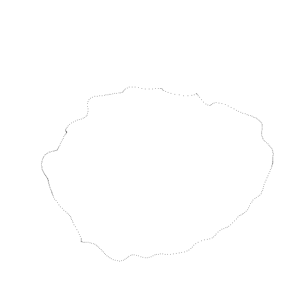
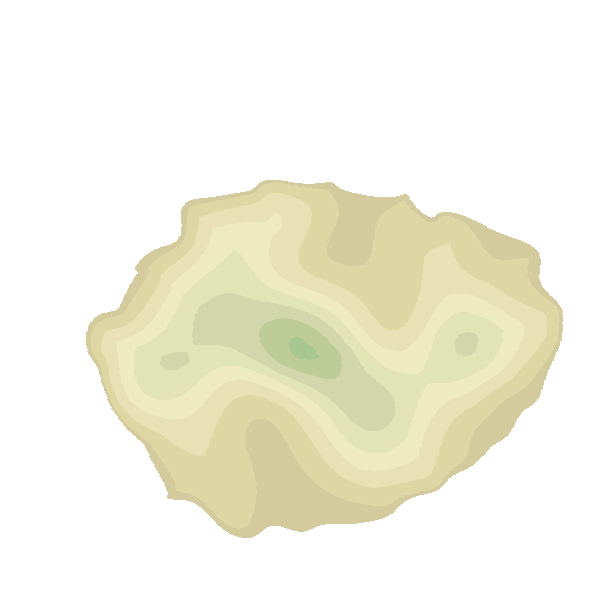
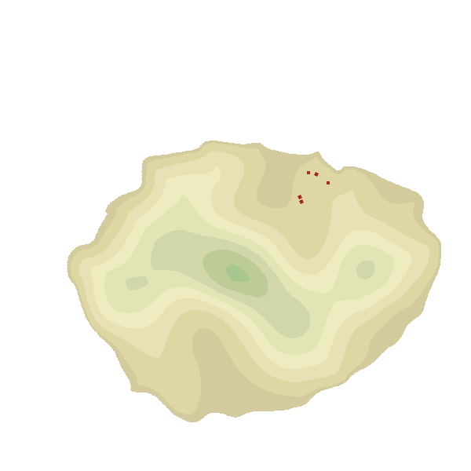
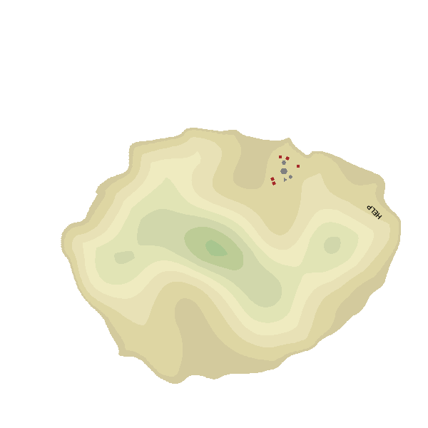

Procedural generation has always been an area of programming that interested me,
however, I've never really done anything related to it before (except for writing
a [simple Perlin noise implementation](https://github.com/flexagoon/perlin) to
understand how the algorithm works). But after watching a talk from the 2018
Strange Loop Conference titled ["Mapping Imaginary Cities"](https://www.youtube.com/watch?v=Ic_5gRVTQ_k),
I finally decided to try my hand at generating stuff.

Since there are already a lot of examples for procedurally generating cities or 
[entire landscapes](https://www.youtube.com/playlist?list=PLFt_AvWsXl0eBW2EiBtl_sxmDtSgZBxB3),
I chose to do something slightly different and generate **uninhabited islands**
instead.

{}

In my code examples, I will be using the [Julia](https://julialang.org) programming
language. The code should mostly be readable even without any prior Julia
knowledge, but for the sake of simplicity, I have omitted a lot of code like
helper functions and macros from this post. The full code for this project can
be found [here](https://github.com/flexagoon/IslandGen).

{}

## basic island shape

Most procedural terrain generators work by taking a [coherent noise](https://mfiano.github.io/CoherentNoise.jl/stable/overview/#What-is-coherent-noise?)
function such as [Perlin noise](https://en.wikipedia.org/wiki/Perlin_noise) and
using its output directly as a height map. However, this wouldn't work for my
case, where I need to generate a single isolated island.

So first, let's start with a circle:

```julia
for r in 0:1°:360°
    x = (WIDTH / 4) * cos(r)
    y = (HEIGHT / 4) * sin(r)

    p = Point(x, y)
    paint(p)
end
```


Unfortunately, [most](https://en.wikipedia.org/wiki/El_Ojo) real-world islands
aren't perfect circles, so we'll have to distort our shape a bit. Let's use a
noise function, but instead of directly drawing its values, we'll use them to
move the points of the circle around.

```julia
function noisify(x, y, noise_weight)
    noise_freq = 1 / noise_weight
    nx = noise_weight * noise(noise_freq * x, noise_freq * y, 0) - nw / 2
    ny = noise_weight * noise(noise_freq * x, noise_freq * y, 1) - nw / 2
    return x + nx, y + ny
end

for r in 0:1°:360°
    x = (WIDTH / 4) * cos(r)
    y = (HEIGHT / 4) * sin(r)
    x, y = noisify(x, y, 300) .|> round

    p = Point(x, y)
    paint(p)
end
```

*(The `.|> round` at the end of the line just rounds the values of x and y. This
is necessary to avoid some errors in future steps)*


Much better. This is still too smooth though, so let's add a smaller noise on
top of that:

```julia
# ...
x, y = noisify(x, y, 300)
x, y = noisify(x, y, 35) .|> round
# ...
```



Nice, his actually looks like an island.

## height map

Remember when I told you I can't use a noise function to generate a height
map for my island? Well, now that I have my island shape defined, nothing's
stopping me from doing that anymore. So let's do just that - iterate over every
point inside of the island and generate a height value for it.

```julia
# `border` is just a list of all points generated in the previous step
bb = BoundingBox(border)
for p in bb
    if !isinside(p, border; allowonedge=true)
        continue
    end

    n = noise(0.01p.x, 0.01p.y)
    setgray(n)
    paint(p)
end
```


Here we go. However, there's an issue with this height map. It has high points
near the edge of our island, which isn't very realistic - ideally, all of the
high points should be near the middle of the island.

So, for every point, I calculate the square root of its distance to the island
border, normalize those values to be between 0 and 1, and mutiply the noise
values by them. *(The square root is used to make things smoother, you can use
raw distance value as well, but the result will be less natural).*

```julia
bb = BoundingBox(border)
distmap = Dict{Point,AbstractFloat}()
for p in bb
    if !isinside(p, border; allowonedge=true)
        continue
    end

    distances = [ √distance(p, bp) for bp in border ]
    distmap[p] = minimum(distances)
end
max_dist = distmap |> values |> maximum

for (point, dist) in distmap
    n = noise(0.01point.x, 0.01point.y)
    elevation = dist / max_dist * n
    setgray(elevation)
    paint(point)
end
```


This actually looks pretty realistic. 

Now let's apply some pretty colors to it:



And there it is, the terrain map of our imaginary island.

## adding people

Now it's time to add some people to our, uhh, uninhabited island?.. Okay, just
ignore the fact that an **uninhabited** island has people on it. Robinson
Crusoe lived on an uninhabited island, and I think it had some people on it?
Whatever. **My** islands **will** have a tribe.

Foremost, we need to generate a location where our tribe will live. In reality,
people choose settlement locations based on a bunch of complex factors, but I'll
take a much simpler approach and just look for an area that's flat enough to
build stuff in.

The algorithm that does it works like this:

1. Pick a random point on the island
2. Get the elevations of all points in a 20x20 area around it
3. Calculate the standard deviation of the elevations
4. Repeat until the standard deviation is below a threshold (0.02 in this case)

Sounds easy, so let's implement that.

```julia
island_points = elevations |> keys
steepness = 1
tribe_location = O  # `O` is a shorthand for `Point(0, 0)`
while steepness > 0.02
    tribe_location = rand(island_points)
    bb = box(tribe_location, 20, 20) |> BoundingBox
    area_elevations = [ elevations[p] for p in bb if p ∈ island_points ]
    steepness = std(area_elevations)
end
```

Let's draw some houses around our central location. For this, I can just
take a bunch of random points in a 19-22 radius around the center and draw
randomly rotated squares at those points.

```julia
setcolor("brown")
house_count = rand(1:5)
for i in 1:house_count
    r = rand(0:5°:360°)
    dist = rand(19:22)
    x = tribe_location.x + dist*cos(r) |> round
    y = tribe_location.y + dist*sin(r) |> round
    p = Point(x, y)
    if p ∈ island_points
        rot = rand(0:1°:90°)
        ngon(p, 3, 4, rot; action=:fill)
    end
end
```



That's cool, but the center of the settlement looks pretty empty. Let's add
something there. Since we're going with an island tribe theme, how about a place
of worship?

The Island Mecca will be a large stone polygon with 3-6 sides. Around the mecca,
there'll be 0-3 smaller polygons ("satellites"), but with the following limitations:

- The amount of satellites can't be higher than the amount of houses in the
  settlement - it would be weird to have 4 sacred buildings for a civilisation
  with only 1 house.
- The number of sides of the sattelites can't be higher than the number of sides
  of the mecca, because they're less significant.

```julia
setcolor("gray")

mecca_sides = rand(3:6)
ngon(tribe_location, 5, mecca_sides; action=:fill)

satellites = Dict{Point,Integer}()
satellite_count = rand(0:min(3, house_count))
for i in 1:satellite_count
    r = rand(0:1°:360°)
    x = tribe_location.x + 12cos(r) |> round
    y = tribe_location.y + 12sin(r) |> round
    p = Point(x, y)
    if p ∈ island_points
        sides = rand(3:mecca_sides)
        ngon(p, 3, sides; action=:fill)
    end
end
```


Wow, we really got lucky here, 5 houses **and** 3 sattelites!

## castaway

Our island is still pretty empty though, so let's add one more thing to it. How
about a "HELP" sign left by an unlucky castaway?

First, let's find a suitable location for the sign. It should be near the border
(have a low elevation) and far enough from our island tribe.

```julia
# Elevation shoud be between 0.1 and 0.2
possible_castaway_points = keys(filter(
    e -> 0.1 < last(e) ≤ 0.2,
    elevations
))

# Shouldn't be closer than 120 points to the tribe
possible_castaway_points = filter(
    p -> distance(p, tribe_location) > 120,
    possible_castaway_points
)

castaway_p = rand(possible_castaway_points)

setcolor("black")
text("HELP", castaway_p)
```

Now we have to just draw the text at the chosen point.


Oops, there's an issue. Our text isn't properly rotated. Unfortunately, it's
pretty hard to calculate a precise rotation angle since our border is a very
complex polygon which you can't easily find a perpendicular line for. However,
for our purposes, a simple estimation should be enough, so let's just find an
angle based on the closest border point.

First, let's actually find the nearest border point:

```julia
border_dist = 9999
for bp in border
    dist = distance(castaway_p, bp)
    if dist < border_dist
        nearest_border_point = bp
        border_dist = dist
    end
end
```

And now we can calculate our text rotation by knowing the point coordinates:

```julia
rx = (nearest_border_point.x - castaway_p.x) / border_dist
ang = (castaway_p.y < nearest_border_point.y
       ? acos(rx) - 90°
       : -acos(rx) - 90°)

setcolor("black")
text("HELP", castaway_p; angle=ang)
```



Our island is complete! Finally, let's add some variation to our generator.

## randomness

I have to confess something to you - the code examples in this post are fake. I
mean, they are real code samples, but they aren't how I'm actually doing things.
Having everything as a bunch of top level code is nice for demonstration purposes,
but for actual coding, it's very inconvenient, so I've actually been writing
all of the previous steps as separate functions.

Which means that the main generation function basically looks like this:

```julia
island = Island()
make_island!(island)
make_elevation!(island)
add_tribe!(island)
add_mecca!(island)
add_castaway!(island)
```

Yes, I'm using [the builder pattern](https://refactoring.guru/design-patterns/builder)
to build an island.

An advantage of this is that I can write a simple macro to run a function with
a specified chance and apply it to our `add_tribe!` and `add_mecca!` functions.

```julia
macro chance(chance, action)
    quote
        if rand() < $chance
            $(esc(action))
        end
    end
end
```

(Don't worry if you're confused by those `quote` and `$(esc())` things - that's just
Julia macro stuff, you don't have to understand them to see what this macro
does)

```julia
# ...
@chance 1/2 add_tribe!(island)
@chance 1/2 add_mecca!(island)
@chance 1/2 add_castaway!(island)
```

Now the tribe and the castaway are only generated on half of the islands, and
the mecca in generated with a 1/4 chance (it can't be generated if there's no
tribe, so its probability is 1/2 * 1/2 = 1/4).

## conclusion

And with all of that, I finally fullfilled my goal of procedurally generating
some fun images. Of course, this project is in no way complete - there's a lot
of stuff that can be added here. Unfortunately, I ran out of imagination and the
artificial deadline I gave myself for this project, so this is gonna be it for
now, but maybe I'll return to it later.

[The full source code for this project can be found on my GitHub.](https://github.com/flexagoon/IslandGen)

---

### skills

Here are the main skills I acquired while working on this:

1. Procedural generation
    
   I got hands-on experience with multiple procedural generation methods. While
   I knew some of that stuff before, I never actually did anything in this area,
   so this experience was very valuable. I may attempt some other procedural
   generation projects in the future.

2. Luxor.jl

   To draw all ow my images, I used the awesome [Luxor.jl](https://github.com/JuliaGraphics/Luxor.jl)
   graphics library. This was my first time using it (and basically my first
   time using any 2D graphics libraries), and I really enjoyed it. I'll definitely
   use it if I ever need to do anything involving graphics again.

3. Finishing projects

   A deadline of 1 week for a project of this size may sound very long for a
   lot of people, and it probably is. Unfortunately, I'm the kind of person
   that starts projects and abandons them after about an hour. Setting a goal
   of completing a project in 1 week really helped me, and I'll definitely do
   the same thing again for other small projects I decide to do.

---


